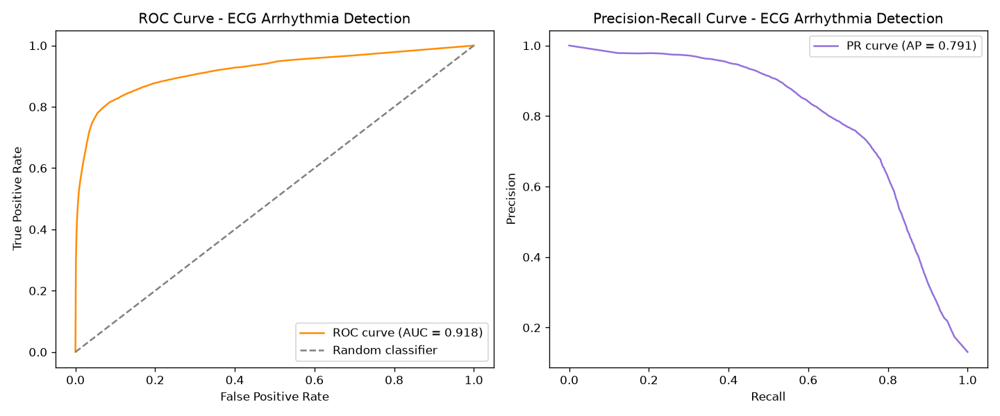

# ECG Arrhythmia Detection

A signal processing and machine learning pipeline that classifies individual heartbeats as **Normal** or **Abnormal** from raw ECG data, using the [MIT-BIH Arrhythmia Database](https://physionet.org/content/mitdb/1.0.0/) (PhysioNet). Built as a first project in biomechatronics data analysis, with a focus on evaluation methodology that reflects how this problem is actually approached in research and clinical screening.

## Why this project is more than a tutorial

Most beginner ECG classification projects train and test on beats from the same patient, which produces misleadingly perfect results (a model I built this way scored 100% accuracy). Real clinical value requires a model that generalises to **patients it has never seen**, so this project follows the **inter-patient evaluation paradigm**, based on the standard methodology from de Chazal et al. (2004). The model is trained on one group of patients and tested on a completely separate group, with no overlap.

## Pipeline

1. **Load** raw ECG signal and cardiologist beat annotations, using `wfdb`
2. **Filter** the signal with a 0.5 to 40 Hz bandpass filter to remove baseline wander and high frequency noise
3. **Detect R-peaks** (heartbeat locations) using a simplified Pan-Tompkins style algorithm: derivative, squaring, moving window integration, peak detection
4. **Extract features per beat**:
   - `pre_rr` and `post_rr`, the time to the previous and next beat
   - `amplitude` and `energy`, describing beat shape and intensity
   - `qrs_width`, an estimate of QRS complex duration (full width half maximum of the beat's energy envelope). This is a physiologically motivated feature: ventricular origin abnormal beats, like PVCs, spread electrically through heart muscle more slowly than normal beats, producing a wider QRS complex
5. **Classify** using a Random Forest, trained on one set of patients and tested on a disjoint set
6. **Evaluate** with precision, recall, and F1 per class, not just accuracy, since accuracy is misleading under class imbalance. A recall prioritized decision threshold reflects real clinical screening priorities, where missing an abnormal beat is worse than a false alarm
7. **Compare against a deep learning approach**, a 1D CNN trained directly on raw beat waveforms, to test whether learned features could outperform hand crafted ones

## Signal Processing Steps

Raw ECG signal, first 10 seconds:


Raw vs filtered signal, showing the bandpass filter removing noise and baseline wander:


Detected R-peaks overlaid on the filtered signal:


## Results

| Stage | Abnormal Precision | Abnormal Recall | Abnormal F1 | Notes |
|---|---|---|---|---|
| Same-patient (naive) | 1.00 | 1.00 | 1.00 | Misleading. Model overlaps train and test patients |
| Inter-patient, 4 basic features | 0.62 | 0.87 | 0.72 | Honest baseline. 6 train, 6 test patients |
| Inter-patient, plus QRS width | 0.66 | 0.84 | 0.74 | Physiologically motivated feature improves precision |
| Full patient split (about 22 vs 22), default threshold | 0.53 | 0.72 | 0.61 | Standard research scale patient split |
| Full patient split, recall prioritized threshold | 0.47 | 0.82 | 0.59 | Threshold lowered to favor catching abnormal beats |
| 1D CNN on raw waveforms (v1, per-beat normalization) | 0.35 | 0.69 | 0.47 | Same full patient split. Learns from raw signal instead of engineered features |
| 1D CNN on raw waveforms (v2, per-recording normalization) | 0.30 | 0.79 | 0.44 | Fixed normalization to preserve amplitude info. Improved recall but not overall F1 |

### Confusion Matrices

Naive same-patient baseline:


Inter-patient, 4 basic features:


Inter-patient, plus QRS width:


Full patient split, recall prioritized threshold:


CNN, version 1:


CNN, version 2:


### CNN Training Curves

Version 1 (per-beat normalization):


Version 2 (per-recording normalization):


## Key Findings

**Beat timing dominates.** The `pre_rr` feature, time since the previous beat, has the highest feature importance across every version of the Random Forest model. Beat shape features (`amplitude`, `energy`, `qrs_width`) contribute real but secondary value.

**Scaling up revealed a harder, more honest problem.** Performance dropped when moving from a small 6-patient split to the full 44-patient research split, with F1 falling from 0.74 to about 0.60. This was not a modeling error. The smaller subset happened to be an easier, less representative sample. The full split exposes the model to the real diversity of arrhythmia presentations across patients, including one test record that is 78 percent abnormal beats, likely a patient with a persistent rhythm disorder rather than occasional ectopic beats. These numbers are consistent with published inter-patient MIT-BIH literature, where precision in the 0.3 to 0.5 range and recall in the 0.7 to 0.9 range is typical at full scale. This is a genuinely difficult problem in the field, not one fully solved by hand crafted features and classical machine learning.

**A raw-waveform CNN did not outperform hand crafted features on this dataset.** I tested whether a 1D CNN, learning directly from raw beat waveforms instead of engineered features, could find better patterns than RR-intervals, amplitude, energy, and QRS width. It did not. The CNN underperformed the Random Forest across every metric. Investigating why, I noticed a large gap between validation accuracy, about 95 percent on held out beats from training patients, and test accuracy, about 80 to 84 percent on entirely unseen patients. This suggests the network partly learned patient specific waveform quirks, such as electrode placement, individual anatomy, or baseline noise character, that do not generalize to new people. This is a more severe version of the same inter-patient generalization challenge seen throughout this project. I also hypothesized that per-beat amplitude normalization was erasing genuinely useful amplitude information, since Random Forest found `amplitude` meaningfully important. Fixing this to normalize per-recording instead improved recall, from 0.69 to 0.79, but not overall F1, indicating the underperformance is a deeper data and architecture limitation rather than a simple preprocessing bug. This is consistent with published caveats about deep learning on MIT-BIH: raw-waveform CNNs typically need larger datasets or architectures specifically designed for inter-patient variability to reliably beat classical feature based methods at this data scale.

## Cross-Validation Results (Full Patient Pool)

The results above use a fixed train/test split. A more statistically robust estimate comes from 5 fold patient grouped cross validation across all 44 patients, producing a mean and standard deviation rather than one single number:

| Metric | Value |
|---|---|
| Precision | 0.703 ± 0.078 |
| Recall | 0.767 ± 0.108 |
| F1 | 0.730 ± 0.080 |
| ROC AUC | 0.918 |
| Average Precision | 0.791 |



Notably, the cross validated F1 (0.730) is meaningfully higher than the fixed 22 versus 22 split result (0.59) reported above. This shows that single split evaluation was, by chance, a particularly difficult split, and demonstrates why cross validation across the full patient pool gives a more reliable performance estimate than any single split.

The spread across folds is also informative on its own: individual fold F1 scores ranged from 0.617 to 0.862, confirming that model performance is highly sensitive to which patients happen to land in the test set, a direct consequence of how much arrhythmia presentation varies from person to person.

## Live Demo

The final model from this project (retrained on a held out patient subset for honest demonstration) is deployed alongside the companion EEG seizure detection project in one combined interactive application, including SHAP based explainability showing which features drove each individual prediction: [biomechatronic-monitor.streamlit.app](https://biomechatronic-monitor.streamlit.app) ([app repository](https://github.com/bansidani-cmd/biomechatronic-monitor))


| File | Description |
|---|---|
| `ecg_arrhythmia_project.py` | First version. Same-patient train and test split, baseline, naive |
| `ecg_interpatient_project.py` | Inter-patient split, 4 basic features |
| `ecg_interpatient_qrswidth.py` | Inter-patient split plus QRS width feature |
| `ecg_full_split_clinical.py` | Full about 44-patient research scale split, plus recall prioritized threshold tuning |
| `ecg_cnn_project.py` | 1D CNN on raw waveforms, per-beat normalization |
| `ecg_cnn_project_v2.py` | 1D CNN on raw waveforms, per-recording normalization, preserves amplitude |
| `ecg_phase1_cv_roc.py` | Patient grouped 5 fold cross validation, ROC and precision recall curves, model saving |
| `ecg_build_demo_model.py` | Trains a held out demonstration model, excluding demo patients entirely, for the live app |

## How to Run

```bash
pip install wfdb numpy scipy scikit-learn matplotlib
python ecg_full_split_clinical.py
```

For the CNN scripts, TensorFlow requires Python 3.10 to 3.13. A separate virtual environment may be needed if your default Python is newer:

```bash
pip install tensorflow
python ecg_cnn_project_v2.py
```

Each script downloads its required MIT-BIH records automatically via `wfdb` on first run.

## What I Would Explore Next

- A larger training set or data augmentation for the CNN, which may be necessary to close the gap with feature based methods
- A hybrid model combining raw waveform input with engineered features, RR-intervals and QRS width, in one network
- Multi-class classification, such as Normal, PVC, APC, and Fusion, instead of binary Normal or Abnormal
- Applying the same pipeline to a second signal type, EEG seizure detection, as a comparative biomechatronics case study

## Background

Built as a first hands on project in biomechatronics, the intersection of biomechanics and control or sensing systems that underlies technologies like prosthetics and exoskeleton control. This project specifically explores the signal processing and evaluation challenges involved in physiological signal classification.
